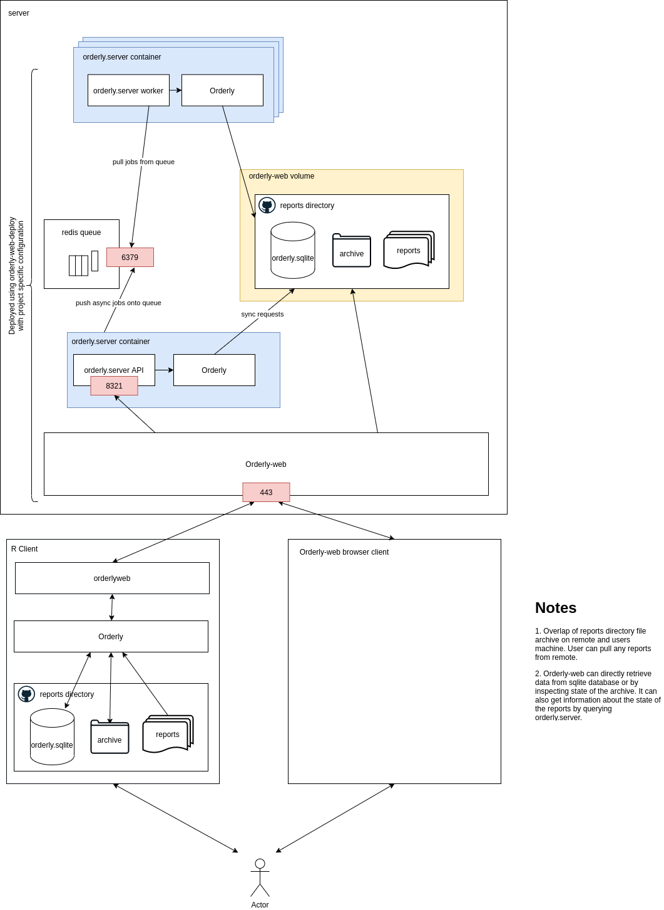

## Orderly architecture

### Core components

* [orderly](https://github.com/vimc/orderly) - the reproducible analysis engine which manages running reports, tracking all inputs & outputs, archiving and retrieval of old versions, dependencies between analyses
* reports directory - a version controlled set of orderly reports/analyses. Stores here an archive of previously run reports and a database containing details of run reports. The archive and database will be different between local and remove but the local archive can pull down reports from the remote archive. This is configured per deployment.
* [orderlyweb](https://github.com/vimc/orderlyweb) - R package which manages interaction with remote from local R session including running reports, pulling from the remote archive and running batches
* Orderly-web browser client - the orderly-web web page running in users browser
* [Orderly-web](https://github.com/vimc/orderly-web) - back end client running on the server which handles requests from R client and from web app. Can run jobs via orderly.server or read data straight from the archive or orderly database to return to user
* [orderly.server](https://github.com/vimc/orderly.server) - API which exposes orderly features to Orderly-web. Can return info syncronously e.g. about the state of git in the report directory, or can run jobs async via queue e.g. running a report
* redis queue - queue stored in redis, managed from orderly.server using [rrq](https://github.com/mrc-ide/rrq)
* [orderly-web-deploy](https://github.com/vimc/orderly-web-deploy) - deployment tool
* [orderly-web-py](https://github.com/vimc/orderly-web-py) - python client for orderly-web

### Additional components

* [orderly-demo](https://github.com/vimc/orderly-demo) - demo orderly repo used for testing
* [orderly.sharepoint](https://github.com/vimc/orderly.sharepoint) - Alternative to orderly-web remote a particular orderly project could use sharepoint to store a remote archive. This is less feature rich than orderly-web remote.
* [orderly.rstudio](https://github.com/vimc/orderly.rstudio) - Provides RStudio addins for orderly

## Deployment configuration

Each specific deployment will have a
* reports directory github repo
* deployment configuration used by orderly-web-deploy to sets things like URLs, environment variables, docker container names, vault address, github repo containing reports directory etc.

and optionally can define
* docker container built from orderly.server container which adds specific R packages and libs needed for that project

### Projects

#### montagu
* reports directory - [montagu-reports](https://github.com/vimc/montagu-reports/)
* orderly.server container - [montagu-orderly](https://github.com/vimc/montagu-orderly/)
* deployment configuration - [montagu-orderly-web](https://github.com/vimc/montagu-orderly-web/)

Note for montagu we also have [montagu-r](https://github.com/vimc/montagu-r) which sits between orderlyweb and Orderly and handles authenticating the R Client using Orderly-web credentials.

#### ncov
* reports directory - [ncov-outputs](https://github.com/ncov-ic/ncov-outputs)
* orderly.server container - [ncov-orderly](https://github.com/ncov-ic/ncov-orderly)
* deployment configuration - [ncov-orderly-web](https://github.com/ncov-ic/ncov-orderly-web)

